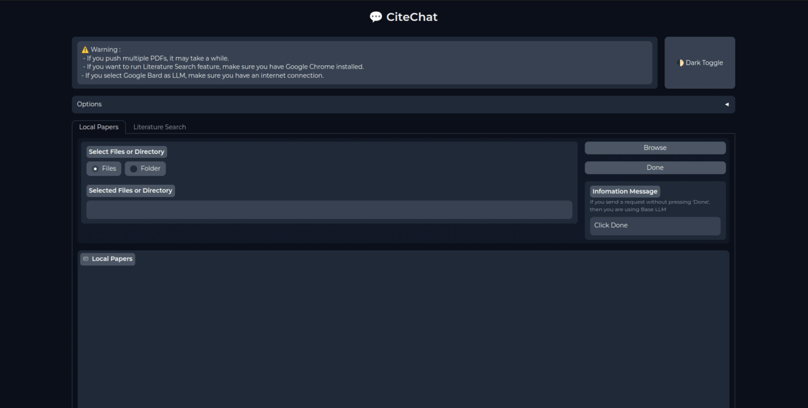
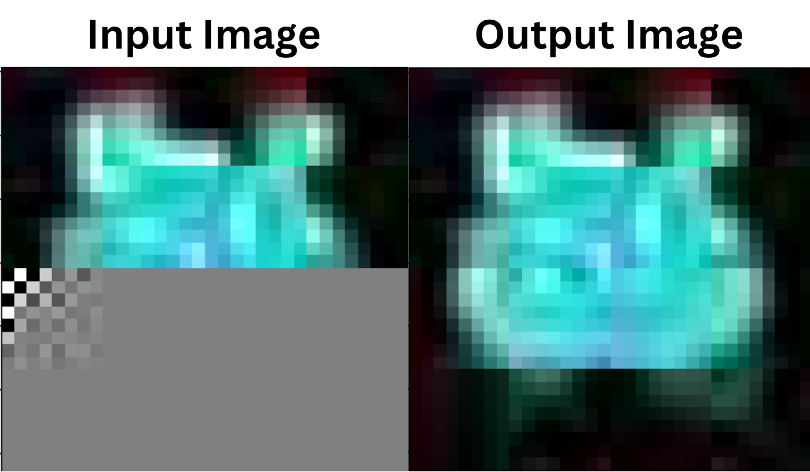
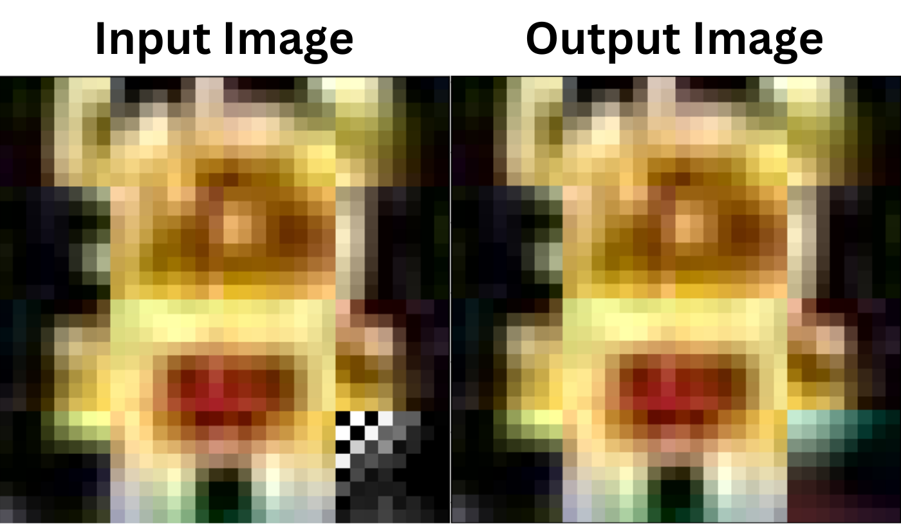
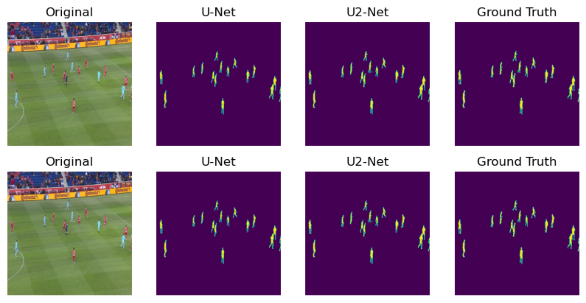
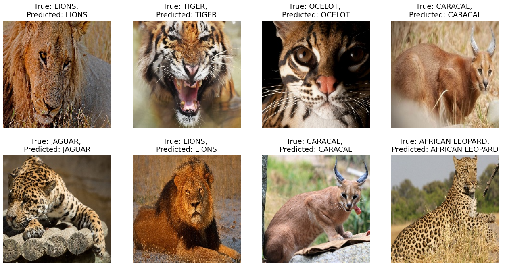
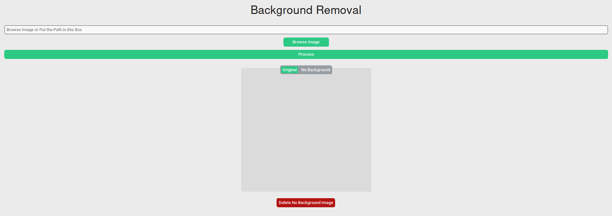

---
hide:
  - navigation
  - footer
---

# **Artificial Intelligence**

## **CiteChat: Research Assistant for Document-Based**

  

    

      
    

    
I integrated large language models such as Google Bard and LLaMA-2 7B GGML (or similar LLMs) into my project. Additionally, I web scraped paper abstracts from platforms like Semantic Scholar and Arxiv to provide enriched content. To facilitate user interaction, I developed a chatbot GUI using Gradio.

    

      
      
      
      
      
    

  

  

    
  

---

## **LLAMA-2 : Train from Scratch Llama2 Architecture**

  

    

      
      
    

    
I developed the LLaMA-2 architecture code from scratch and pre-trained the model entirely from the ground up. Additionally, I provided a detailed explanation of the architecture in my blog, Notes on Anything - LLAMA2.

    

      
      
    

  

---

## **JPEG-LM : Finetune on Pixel Art Image Dataset**

  

    

      
      
    

    
I fine-tuned the “uwnlp/jpeg-lm-reimplementation” model on a dataset of 62,580 images, each consisting of 32x32 pixel art, to enhance its performance and adaptability to this specific domain.

    

      
      
    

  

  

    
  

---

## **JPEG-LM : Image Generators using JPEG Canonical Codecs and LLM**

  

    

      
      
    

    
I reimplemented the training code from the original JPEG-LM paper and conducted pre-training using the LLaMA-2 architecture configured with Qwen2-1B specifications. The model was pre-trained on a dataset of 62,580 images, each comprising 32x32 pixel art. I also provided a comprehensive explanation of the model and its training process in my blog, Notes on Anything - JPEG-LM.

    

      
      
    

  

  

    
  

---

## **Football Players Segmentation with U-Net and U2-Net**

  

    

      
      
    

    
I built the U-Net and U2-Net architectures from scratch using TensorFlow, focusing on efficient and accurate implementations. Additionally, I provided an in-depth explanation of the architectures in a detailed notebook to enhance understanding and facilitate learning.

    

      
      
    

  

  

    
  

---

## **Big Cat Classification with SpinalNet**

  

    

      
      
    

    
I developed a model from scratch using TensorFlow, integrating the ResNet101 architecture for powerful feature extraction and classification. The project focused on classifying big cat species with high accuracy. A detailed explanation of the architecture and its implementation was provided in the accompanying notebook to support learning and reproducibility.

    

      
      
    

  

  

    
  

---

## **Background Removal Desktop Application**

  

    

      
    

    
I developed a model from scratch using TensorFlow, incorporating the ResNet101 architecture for robust feature extraction and performance. I also provided a detailed explanation of the architecture in a comprehensive notebook to support learning and understanding.

    

      
    

  

  

    
  

