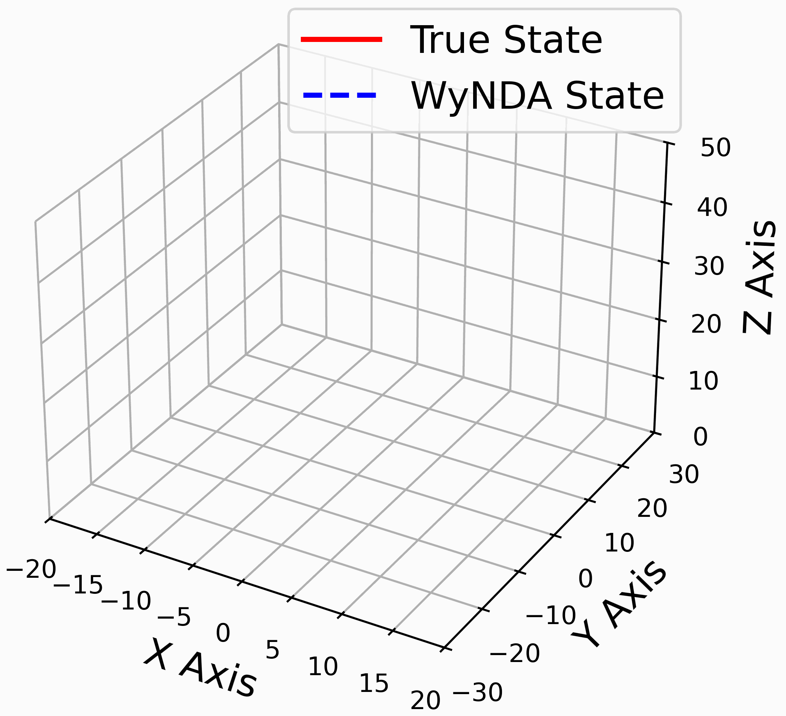

---
hide:
  - navigation
  - footer
---

# **Robotics**

## **MAP-IT : 2D Mapping Iterative Closest Point and Pose Graph on Mobile Robot**

  

    

      
      
      
    

    
I applied the Levenberg-Marquardt algorithm for Point to Line Iterative Closest Point (PLICP) and developed occupancy grid mapping from scratch using NumPy. 
    Additionally, I built a web application for mobile robot control, integrating it seamlessly with Robot Operating System 2 (ROS2) to enhance functionality and user interaction. 
    Furthermore, I published a paper on my work at the International Conference of Advanced Technology and Multidiscipline (ICATAM 2024).

    

      
      
      
    

  

  

    <video src="../assets/media/mapit.mp4" style="text-align: center; justify-content: center;" alt="Quadcopter Simulation" width="350px" type="video/mp4" controls></video>
    
  

---

## **WyNDA : Data-Driven Discovery for Mathematical Model**

  

    

      
      
      
    

    
I reimplemented the code from the paper “WyNDA: A Method to Discover Mathematical Models of Dynamical Systems from Data” 
    and developed both Python and C++ implementations to extract mathematical models of dynamical systems from observational data.

    

      
      
      
    

  

  

    
  

<!-- ---

## **MuJoCo Simulation of PLICP Graph SLAM Mapping**

  

    

      
    

    
I implemented minimum snap trajectory optimization for both position and orientation, as well as geometric control on \(SE(3)\) for nonlinear control in non-flat spaces. 
    Additionally, I built a 3D simulation environment using MuJoCo to test and validate these control strategies.

    

      
      
    

  

  

    
  

 -->

---

## **Quadcopter Trajectory Planning and Tracking 3D Simulation**

  

    

      
      
    

    
I implemented minimum snap trajectory optimization for both position and orientation, as well as geometric control on \(SE(3)\) for nonlinear control in non-flat spaces. 
    Additionally, I built a 3D simulation environment using MuJoCo to test and validate these control strategies.

    

      
      
    

  

  

    
  

